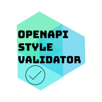

# OpenApi Tools: OpenAPI Style Validator



A customizable style validator to make sure your OpenApi spec follows your organization's standards.

[](https://offset.earth/darkjaff)

 [](https://mvnrepository.com/artifact/org.openapitools.openapistylevalidator) [](https://sonarcloud.io/dashboard?id=OpenAPITools_openapi-style-validator) [](https://sonarcloud.io/dashboard?id=OpenAPITools_openapi-style-validator)

[](https://join.slack.com/t/openapi-generator/shared_invite/enQtNzAyNDMyOTU0OTE1LTY5ZDBiNDI5NzI5ZjQ1Y2E5OWVjMjZkYzY1ZGM2MWQ4YWFjMzcyNDY5MGI4NjQxNDBiMTlmZTc5NjY2ZTQ5MGM) [](https://openapitools.github.io/openapi-style-validator/) [](https://gitpod.io/#https://github.com/OpenAPITools/openapi-style-validator)

## Summary

Unless you are working alone on a very small API, you are probably working with other people on your spec (YAML) file.
Even if you have written directions and standards in a shared PDF or on a wiki somewhere and sent it to all the team
members, there is no way to be sure they will follow it.

You could argue that you will do code review to prevent these errors. Yes you could but wouldn't it be better if you
could automatize all of this? You can still do code reviews to find business/requirements/REST path errors
but let openapi-style-validator validate the style and standards like mandatory examples, naming conventions,
description, etc...

## :trophy: Sponsors

Thanks to our sponsors for supporting this project!

### :1st_place_medal: Gold

[](https://framer.buildwithfern.com/)

### :2nd_place_medal: Silver

[Select your sponsor tier](https://github.com/sponsors/JFCote) and get your logo here with a link to your website.

### :3rd_place_medal: Bronze

[Select your sponsor tier](https://github.com/sponsors/JFCote) and get your company name here with a link to your website.

## What it can validate

### API Info
- API license must be present and non-empty string
- API description must be present and non-empty string
- API contact must be present and non-empty string

### Operations
- OperationId must be present and non-empty string
- Operation description must be present and non-empty string
- Operation must have a tag and non-empty string
- Operation summary must be present and non-empty string

### Models
- All model properties must have examples
- All model properties must have descriptions
- All required properties must be listed among the properties

### Naming convention
- Enforce naming convention for paths, parameters (path, query and cookie), headers and properties
  - underscore_case
  - UNDERSCORE_UPPER_CASE
  - camelCase
  - hyphen-case
  - Hyphen-Upper-Case

## Paid Alternatives

This project was started because when I tried SwaggerHub (which is the paid version of the swagger toolkit), they had
something similar, but it was proprietary. I didn't want to pay for the service so I created this project in my free
times. I did not validate lately if they still have this feature.

## How to use the style validator

For now, the project is a simple command line interface (CLI) and a library. The easiest way to use it right now
is to use the CLI and check the output. It will list all errors found based on the options you provided.

### To build

The project is configured to use gradle. To build the jar, just do:

`gradlew assemble`

or if you want to invoke the jar creation directly

`gradlew shadowJar`

### To change the code

If you want to open the project, I highly suggest that you use IntelliJ IDEA Community (Free) or Ultimate (paid).
This IDE is cross platform so it should work on any OS. This project was created using this tool and you can just open it directly. Maybe you can use other tools to open the project but I will not provide any support.

### To launch

`java -jar openapi-style-validator.jar -s ./path/to/spec.yaml -o ./path/to/options.json`

Example using the default output path for the jar (replace `<version>` with the current version):

`java -jar modules/cli/build/libs/openapi-style-validator-cli-<version>-all.jar -s specs/petstore.yaml -o specs/options.json`

#### Command Line

|Parameter|Required?|Description|
|---|---|---|
|-s, -source|yes|The path to your json/yaml spec file|
|-o, -options|no|The path to your json options file|

#### Options File
The options file is described in json (example in `specs/options.json`), and has the following possible values:

|Option|Type| Possible Values                                                                                                |Default Value|Description|
|---|---|----------------------------------------------------------------------------------------------------------------|---|---|
|validateInfoLicense|boolean| `true`, `false`                                                                                                |`true`|Ensures that there is a license section in the info section|
|validateInfoDescription|boolean| `true`, `false`                                                                                                |`true`|Ensures that there is a description attribute in the info section|
|validateInfoContact|boolean| `true`, `false`                                                                                                |`true`|Ensures that there is a contact section in the info section|
|validateOperationOperationId|boolean| `true`, `false`                                                                                                |`true`|Ensures that there is an operation id for each operation|
|validateOperationDescription|boolean| `true`, `false`                                                                                                |`true`|Ensures that there is a description for each operation|
|validateOperationTag|boolean| `true`, `false`                                                                                                |`true`|Ensures that there is a tag for each operation|
|validateOperationSummary|boolean| `true`, `false`                                                                                                |`true`|Ensures that there is a summary for each operation|
|validateModelPropertiesExample|boolean| `true`, `false`                                                                                                |`true`|Ensures that the properties of the Schemas have an example value defined|
|validateModelPropertiesDescription|boolean| `true`, `false`                                                                                                |`true`|Ensures that the properties of the Schemas have a description value defined|
|validateModelRequiredProperties|boolean| `true`, `false`                                                                                                |`true`|Ensures that all required properties of the Schemas are listed among their properties|
|validateModelNoLocalDef|boolean| `true`, `false`                                                                                                |`true`|Not implemented yet|
|validateNaming|boolean| `true`, `false`                                                                                                |`true`|Ensures the names follow a given naming convention|
|ignoreHeaderXNaming|boolean| `true`, `false`                                                                                                |`true`|Exclude from validation header parameters starting with `x-`|
|pathNamingConvention|string| `CamelCase`, `PascalCase`, `HyphenUpperCase`, `HyphenCase`, `UnderscoreCase`, `UnderscoreUpperCase`, `AnyCase` |`HyphenCase`|Naming convention for paths|
|parameterNamingConvention|string| `CamelCase`, `PascalCase`, `HyphenUpperCase`, `HyphenCase`, `UnderscoreCase`, `UnderscoreUpperCase`, `AnyCase` |`CamelCase`|Global naming convention for all parameter types (path, query and cookie) [(note)](#parameter-naming-convention-hierarchy)|
|pathParamNamingConvention|string| `CamelCase`, `PascalCase`, `HyphenUpperCase`, `HyphenCase`, `UnderscoreCase`, `UnderscoreUpperCase`, `AnyCase` |(same as `parameterNamingConvention`)|Specific naming convention for path parameters [(note)](#parameter-naming-convention-hierarchy)|
|queryParamNamingConvention|string| `CamelCase`, `PascalCase`, `HyphenUpperCase`, `HyphenCase`, `UnderscoreCase`, `UnderscoreUpperCase`, `AnyCase` |(same as `parameterNamingConvention`)|Specific naming convention for query parameters [(note)](#parameter-naming-convention-hierarchy)|
|cookieParamNamingConvention|string| `CamelCase`, `PascalCase`, `HyphenUpperCase`, `HyphenCase`, `UnderscoreCase`, `UnderscoreUpperCase`, `AnyCase` |(same as `parameterNamingConvention`)|Specific naming convention for cookie parameters [(note)](#parameter-naming-convention-hierarchy)|
|headerNamingConvention|string| `CamelCase`, `PascalCase`, `HyphenUpperCase`, `HyphenCase`, `UnderscoreCase`, `UnderscoreUpperCase`, `AnyCase` |`UnderscoreUpperCase`|Naming convention for headers|
|schemaNamingConvention|string| `CamelCase`, `PascalCase`, `HyphenUpperCase`, `HyphenCase`, `UnderscoreCase`, `UnderscoreUpperCase`, `AnyCase` |`PascalCase`|Naming convention for schemas|
|propertyNamingConvention|string| `CamelCase`, `PascalCase`, `HyphenUpperCase`, `HyphenCase`, `UnderscoreCase`, `UnderscoreUpperCase`, `AnyCase` |`CamelCase`|Naming convention for properties|
|allowedModelProperties|array| `["_links", "_embedded"]`|`[]`|An array of property names that are authorised even if they do not match to the "propertyNamingConvention"|

#### Parameter Naming Convention hierarchy

The Parameter Naming Convention can be defined by a combination of the following options in the `options.json` file:
- parameterNamingConvention
- pathParamNamingConvention
- queryParamNamingConvention
- cookieParamNamingConvention

The first option (parameterNamingConvention) defines a global convention for all other parameter naming convention options (path, query and cookie), unless they are explicitly defined in the `options.json` file.

In other words, the `pathParamNamingConvention`, `queryParamNamingConvention` and `cookieParamNamingConvention` are specific for the parameter type their names indicate. Thus, they take precedence over `parameterNamingConvention` when they are defined. If not defined, the undefined option is assigned the same value for `parameterNamingConvention` (either explicitly defined or default).

Example 1:
```json
{
  /*
    'parameterNamingConvention' is not defined.
        Then it assumes the 'CamelCase' convention.
   */
  "pathParamNamingConvention": "UnderscoreCase",
  "queryParamNamingConvention": "HyphenCase"
  /*
    'cookieParamNamingConvention' is not defined.
        Then it assumes the same value as 'parameterNamingConvention',
        which is its default value ('CamelCase').
   */
}
```

Example 2:
```json
{
  "parameterNamingConvention": "HyphenCase",
  "pathParamNamingConvention": "UnderscoreCase",
  "queryParamNamingConvention": "HyphenCase"
  /*
    'cookieParamNamingConvention' is not defined.
        Then it assumes the same value as 'parameterNamingConvention',
        which is explicitly defined as 'HyphenCase'.
   */
}
```

## Supported Extensions

We sometimes have some paths in our API that are there for legacy reasons. To support this scenario, there is now the possibility to add an extension property in your spec named `x-style-validator-ignored`. Here is an example:

```yaml
/my-pathWithWeird_NAMING-FoRLeGaCyReAsOnSLOL:
  x-style-validator-ignored: true
  post:
    tags:
      - Whatever
    summary: A summary
    /* missing operating id or other important property */
    responses:
      200:
        description: OK
  get:
    ...
```

The path (GET, POST, etc..) will be completely ignored by the style validator.

## Roadmap

To view the latest version of the roadmap, please see the [official roadmap](https://openapitools.github.io/openapi-style-validator/docs/roadmap/).

## Releases on maven central

The different components of this project are released on Maven Central:

The core library:

```xml
<dependency>
  <groupId>org.openapitools.openapistylevalidator</groupId>
  <artifactId>openapi-style-validator-lib</artifactId>
  <version>${validatorVersion}</version>
</dependency>
```

The command line tool (without dependency):

```xml
<dependency>
  <groupId>org.openapitools.openapistylevalidator</groupId>
  <artifactId>openapi-style-validator-cli</artifactId>
  <version>${validatorVersion}</version>
</dependency>
```

The command line tool is also available as standalone jar (containing its dependencies):

```xml
<dependency>
  <groupId>org.openapitools.openapistylevalidator</groupId>
  <artifactId>openapi-style-validator-cli</artifactId>
  <version>${validatorVersion}</version>
  <classifier>all</classifier>
</dependency>
```

You can download it manually (replace the `<version>` placeholder in following URL):

```
https://repo1.maven.org/maven2/org/openapitools/openapistylevalidator/openapi-style-validator-cli/<version>/openapi-style-validator-cli-<version>-all.jar
```
